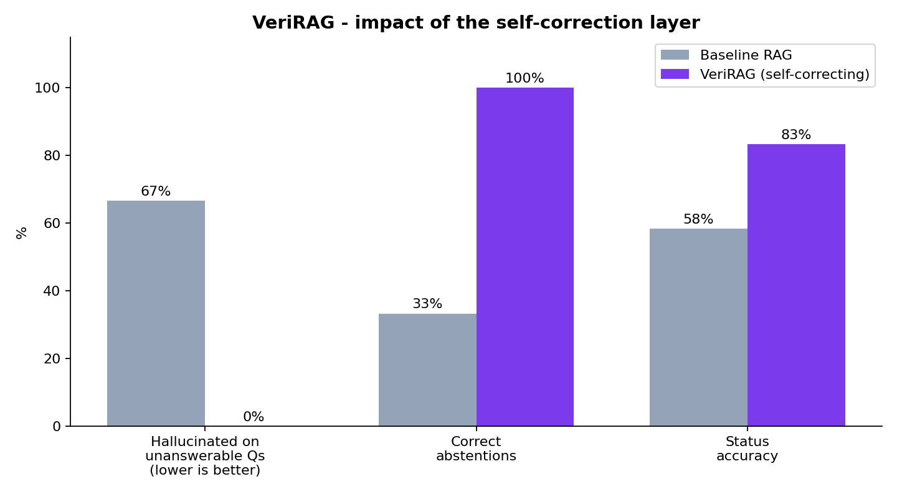

# VeriRAG

**A smart document Q&A system that refuses to make things up.**

Built for the **OneInbox AI Internship Hackathon 2026** — AI Engineer track,
Problem Statement 1: *Self-Correcting RAG Pipeline*.

### 🔗 Live demo: **https://verirag.onrender.com**  ·  Console: **/app**

> Hosted on a free tier, so the first visit may take ~50 seconds to wake up.
> After that it's fast.

---

## What problem does it solve?

Normal RAG systems (document Q&A tools) have one big flaw: **they always give an
answer** — even when the documents don't actually contain it. You get a
confident, well-written, wrong answer that *looks* exactly like a correct one.
That's a hallucination, and it's dangerous in areas like law, medicine, and
finance, where **a confident wrong answer is worse than no answer at all.**

## What VeriRAG does differently

VeriRAG only answers when it can prove the answer is backed by the documents.

- **Before** answering, it checks: *is the evidence I found good enough?*
- **After** answering, it checks: *does my answer actually match the sources?*

If the evidence isn't good enough, it does one of three honest things instead of
guessing:

- **Search again** — rephrase the question and retry (max 2 times)
- **Ask you to clarify** — when the question is unclear
- **Say "I don't know"** — and clearly flag it as low-confidence

Every answer also comes with a **confidence score, its sources, and a full
step-by-step trace** of how it decided.

---

## How it works (the agent loop)

```
retrieve → grade the evidence
   good enough       → write answer → check the answer is grounded → done
   borderline        → rephrase & search again (up to 2 times) → else ask to clarify
   not good enough   → say "I don't know"

check answer:
   backed by sources     → return it
   not backed by sources → downgrade to "I don't know"
```

**Two safety checks, not one.** One check catches *bad search results* before
answering. The other catches the model *making things up* after answering.
Removing either one leaves a gap.

**The grader can't cheat.** An AI judge alone can be confidently wrong, so its
confidence is capped by the actual similarity score from the vector search. This
stops it from approving weak results.

**The loop always stops.** At most 2 retries, plus a hard safety limit — so it
can never loop forever, and cost/latency stay predictable.

---

## Results

Measured over the **12 golden questions** in `data/golden/qa.yaml`, comparing a
plain baseline RAG (retrieve → answer, always) against the VeriRAG agent.

| Metric | Baseline RAG | VeriRAG |
|---|---:|---:|
| **Hallucinated on unanswerable questions** (lower is better) | **2 / 3 (67%)** | **0 / 3 (0%)** |
| Correct "I don't know" answers | 1 / 3 | 3 / 3 |
| Answerable questions answered correctly | 7 / 7 | 6 / 7 |
| Chose the right action (status accuracy) | 58% | 83% |



**The headline:** on questions the documents genuinely can't answer, the baseline
invented an answer two out of three times; **VeriRAG refused every time.** It also
picked the right action (answer / abstain / clarify / flag) far more often.

VeriRAG answered 6 of 7 answerable questions instead of 7 — it was slightly
over-cautious on one. That's the deliberate trade: **we prefer an occasional
"I don't know" over a confident wrong answer.** We report abstention accuracy
*alongside* the hallucination rate precisely so this trade is visible — a system
can't game the score by simply refusing everything.

> Reproduce: `python eval/run_eval.py`. Metrics above are judge-independent
> (based on whether it answered/abstained and picked the correct action), so they
> don't depend on any single model's opinion.

---

## Tech stack (and why)

| Part | Tool | Why |
|---|---|---|
| Agent brain | **LangGraph** | Lets the system loop, branch, and remember state — that's what makes it an *agent*, not a fixed pipeline |
| Language model | **Groq / Gemini / Ollama** | Swap with one setting. All free; Ollama runs fully offline as backup |
| Embeddings | **fastembed** (local) | Runs on your machine — no cost, no rate limits |
| Vector search | **Qdrant** | Open-source; its similarity scores are used to fact-check the grader |
| Reading scans | **Tesseract OCR** + pdfplumber | Pulls text out of scanned images and messy PDFs |
| API | **FastAPI** | Fast, typed, handles many requests at once |
| Background jobs | **Celery + Redis** | Ingests documents without blocking the app |
| Packaging | **Docker** | The whole thing starts with one command |

**Total API cost: ₹0.** Embeddings run locally and all LLM calls use free tiers.

---

## Run it yourself

You need **Docker Desktop** and a free LLM key
([Groq](https://console.groq.com/keys) or [Gemini](https://aistudio.google.com/apikey)).

```bash
# 1. Configure
cp .env.example .env
#    then set in .env:  LLM_PROVIDER=groq  and  GROQ_API_KEY=gsk_...

# 2. Start everything (API + worker + Qdrant + Redis)
docker compose up --build -d

# 3. Load the demo documents
curl -X POST http://localhost:8001/api/ingest/seed
```

Open it:
- Landing page → **http://localhost:8001/**
- Console → **http://localhost:8001/app**

Run the tests (no key or services needed):

```bash
pytest -q
```

See [DEPLOY.md](DEPLOY.md) for putting it online (free) on Render.

---

## Try these four questions

The demo documents are built on purpose so each behaviour is easy to show:

| Ask this | What happens | Why it matters |
|---|---|---|
| *How many casual leave days do full-time employees get?* | **Answers** with a citation | Normal, correct answering |
| *When does the production deployment freeze apply?* | **Answers from a scanned image** | The OCR pipeline works |
| *What is the notice period when resigning?* | **Flags a contradiction** (60 vs 30 days) | Catches conflicting sources |
| *What is the CEO's home address?* | **Says "I don't know"** | Refuses to invent an answer |

Open the **decision trace** under any answer to see the confidence score,
reasoning, and the path it took.

---

## API

| Endpoint | What it does |
|---|---|
| `GET /api/health` | Status, indexed chunk count, current settings |
| `POST /api/ingest` | Upload documents (processed in the background) |
| `GET /api/status/{task_id}` | Check ingestion progress |
| `POST /api/ingest/seed` | Load everything in `data/raw` |
| `POST /api/query` | Ask the agent a question |
| `DELETE /api/index` | Clear the vector store |

`POST /api/query` returns the answer plus its `status`, `confidence`,
`attempts`, `contradiction` flag, `sources`, and the full **decision trace**.

---

## Design choices (deliberate)

- **No internet search.** It only uses the provided documents. Letting it search
  the web would bring back ungrounded answers — the exact thing we're avoiding.
- **When unsure, it abstains.** No confidence, no documents, database down,
  verifier unsure → it says "I don't know". It never answers by default.
- **The decision logic is dependency-free** (`app/graph/routing.py`), so the most
  important safety logic is simple and fully unit-tested.

---

## Known limits

- Very blurry scans can still defeat OCR — those get flagged, not silently
  indexed as garbage.
- Retrying makes some answers slower — a fair trade for not hallucinating.
- Thresholds are tuned on 12 questions; a real product would use many more.
- Questions that span three or more documents are the weakest case.

---

## Project layout

```
app/
  config.py            settings + thresholds
  graph/               the agent: routing, nodes, build, prompts, state
  llm/                 Groq / Gemini / Ollama behind one interface
  ingestion/           read (OCR) → clean → chunk → embed → store
  retrieval/           fastembed + Qdrant
  api/                 routes + schemas
eval/                  baseline vs VeriRAG comparison + scoring
data/golden/qa.yaml    the 12 test questions
web/index.html         landing page
web/app.html           the console (ask box, upload, decision trace)
```

---

Built by **Jayant Raj** for the OneInbox AI Internship Hackathon 2026.
